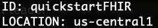
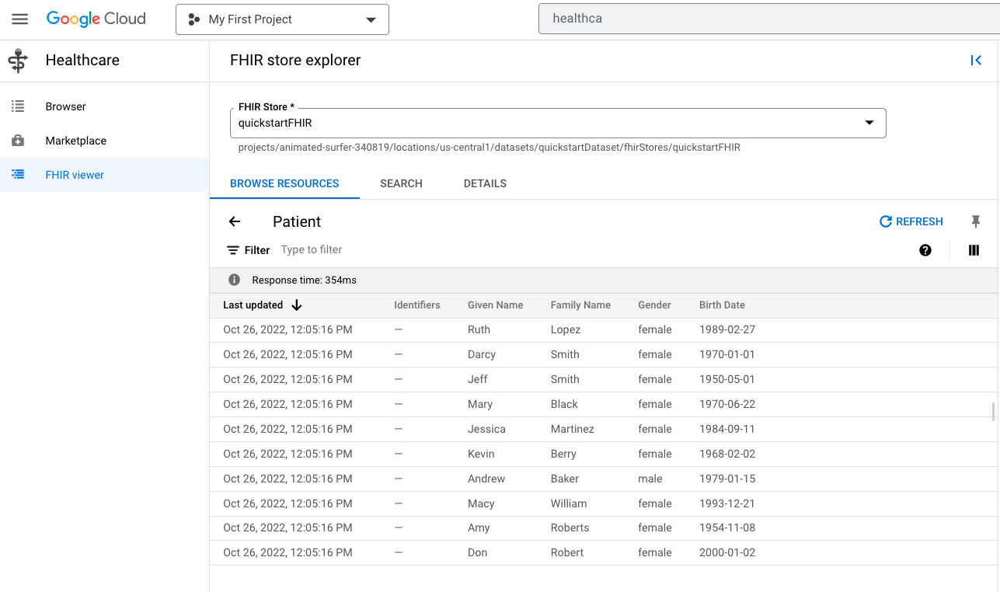
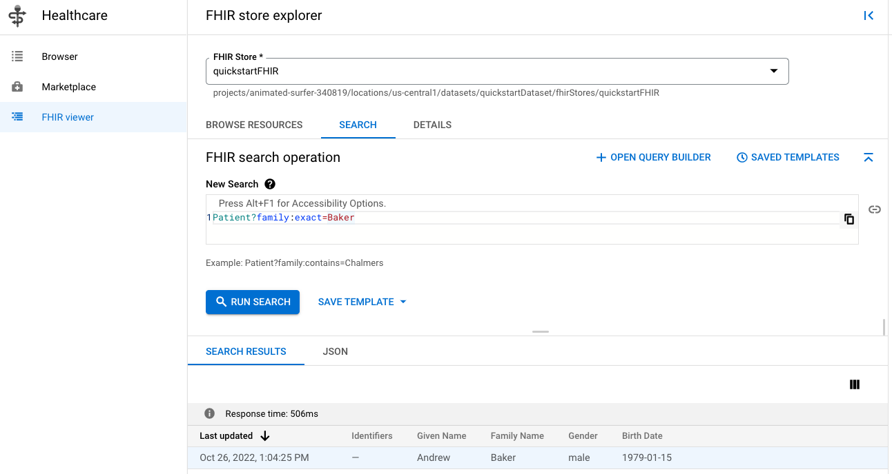
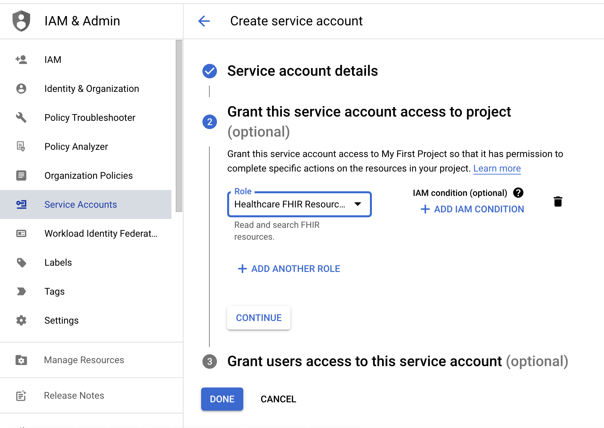
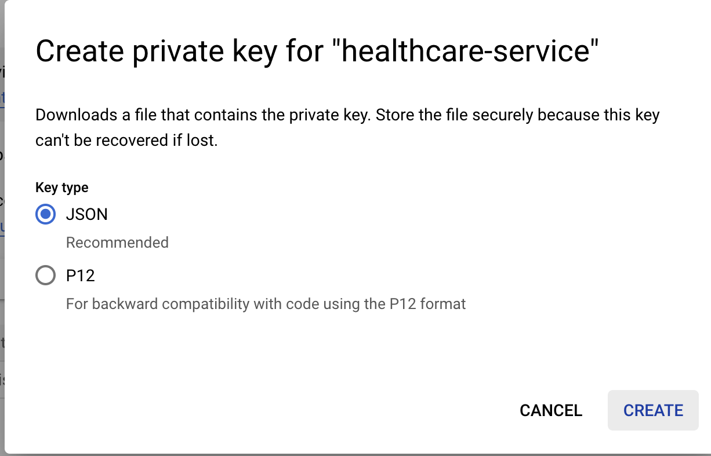

# Google Cloud Healthcare API Quickstart
The following tutorial is a brief overview of how to setup and use Google's Cloud Healthcare API. To learn more, visit our **[documentation](https://cloud.google.com/healthcare-api)**.

In this tutorial, you will learn how to:
1. Setup the Cloud Healthcare API
2. Load data into a FHIR store
3. Retrieve (query) data from a FHIR store
4. De-identify and purge customer PII

### 0. Install Dependencies
Please **[install](https://cloud.google.com/sdk/docs/install)** and **[initialize](https://cloud.google.com/sdk/docs/initializing)** the gcloud CLI. We will use the CLI to create, manage, and destroy our healthcare datasets.

### 1. Setup the Cloud Healthcare API
The code in the following section can be found in the **[code/create_infrastructure.sh](https://github.com/kramer003/Google-Cloud-Healthcare-API-Quickstart/blob/main/code/1_create_infrastructure.sh)** script. Feel free to execute the entire script, or follow along section by section.


The first step to using the Cloud Healthcare API is to setup a dataset, which acts as a centralized location for your healthcare data. The dataset can be configured as follows:
```
gcloud healthcare datasets create quickstartDataset
```

With the dataset created, we can now create one or more datastores within this dataset, designed to hold all different types of medical data, such as FHIR, DICOM and HIL7v2. To learn more about what types of data can be stored, view our **[data model](https://cloud.google.com/healthcare-api/docs/concepts/introduction#data_model)**.

In this case, we will be creating a sample FHIR store, as shown below:
```
gcloud healthcare fhir-stores create quickstartFHIR \
	--version=r4 \
	--dataset=quickstartDataset
```

As a last step, let's ensure our FHIR store was setup correctly with the `list` command
```
gcloud healthcare fhir-stores list --dataset=quickstartDataset
```


### 2. Load data into a FHIR store
The **[data/resources.ndjson](https://github.com/kramer003/Google-Cloud-Healthcare-API-Quickstart/blob/main/data/resources.ndjson)** file contains information on 10 sample patients following the **[Resource](https://console.cloud.google.com/healthcare/browser/locations/us-central1/datasets/quickstartDataset/fhirStores/quickstartFHIR/import?project=animated-surfer-340819)** content structure.

All patients are structured in the following json format:
```
{"birthDate":"1970-01-01","gender":"female","id":"2938bb9e-1f16-429e-8d44-9508ab0e4151","name":[{"family":"Smith","given":["Darcy"],"use":"official"}],"resourceType":"Patient"}
```

I typically recommend working with small dummy data while you get the hand of the Healthcare API. As you become more comfortable, I'd recommend using **[Synthea](https://synthea.mitre.org/)** to generate synthetic healthcare data that more closely mimics your final production state.

The code in the following section can be found in the **[code/2_load_data.sh](https://github.com/kramer003/Google-Cloud-Healthcare-API-Quickstart/blob/main/code/2_load_data.sh)** file. 

As a prerequisite of loading our data into our FHIR store, we must first move the data to Cloud Storage, as follows:
```
gsutil cp data/resources.ndjson gs://<your GCS bucket>
```

With the data in Cloud Storage, we can now import into our FHIR store:
```
gcloud healthcare fhir-stores import gcs quickstartFHIR \
	--gcs-uri=gs://<your GCS bucket> \
	--dataset=quickstartDataset \
	--content-structure=RESOURCE
```

If your import was successful, you should see a `complete...done` message in the log. A good way to double check. As a quick sanity check, it is a good idea to check your Patients in the FHIR viewer, and ensure they are correctly loaded.



### 3. Retrieve data from a FHIR store
The simplest way to view your data is through a **[search](https://cloud.google.com/healthcare-api/docs/how-tos/fhir-search)**. Note that a search becomes expensive as your data scales, most customers perform a **[read](https://cloud.google.com/healthcare-api/docs/reference/rest/v1/projects.locations.datasets.fhirStores.fhir/read)** using an exact resource id.

Let's start by running a simple query in our FHIR viewer. Let's search for patients with the last name "Baker" with the query `Patient?family:exact=Baker`

You should see the following in the FHIR search:


Additionally, Google has a Python **[Client Library](https://cloud.google.com/python/references/libraries)** that you can use to query the data. 

You will first need to install the google-auth library with the following command
```
pip install google-auth
```
Next, we will need to create a **[service account](https://cloud.google.com/iam/docs/service-accounts)** to perform FHIR queries on our behalf. Service accounts should have only the minimum permissions to run the job. For production use cases, you should consider using **[Application Default Credentials](https://cloud.google.com/docs/authentication/provide-credentials-adc)** in order to protect your credentials.

You can create the service account under `IAM` with the `Healthcare FHIR Resource Reader` permission


Once your service account is created, you will need to create a .json key file. Store this file securely on your computer.


Now, open the `3_query_data.py` file and update the following code
```
os.environ["GOOGLE_APPLICATION_CREDENTIALS"] = "<path to your credentials file?"

project_id = "<your project name>"
location = "<Healthcare Dataset Location>"
dataset_id = "<Healthcare Dataset id>"
fhir_store_id = "<Healthcare FHIR Store id>"
```

with this file configured, you can execute the file running `python3 3_query_data.py`. If you open up the `query_data_function.py` file, you see we are running the following query `family:exact=William` to search for patients with the last name William.

The following JSON is returned as a search result. The search returned the information for the patient Macy William
```
{'birthDate': '1993-12-21', 'gender': 'female', 'id': '2938bb9e-1f16-429e-8d44-9508ab0e4153', 'meta': {'lastUpdated': '2022-10-26T17:04:25.584183+00:00', 'versionId': 'MTY2NjgwMzg2NTU4NDE4MzAwMA'}, 'name': [{'family': 'William', 'given': ['Macy'], 'use': 'official'}], 'resourceType': 'Patient'}
```

### 4. De-identify and purge customers
When analyzing customer data, you may want to **[de-identify](https://cloud.google.com/healthcare-api/docs/concepts/de-identification#:~:text=De%2Didentification%20is%20the%20process,or%20otherwise%20obscure%20the%20data.)** the data so that individuals cannot be identified from the data. This clean, de-identified dataset is the first step in further analyses, such as dashboards and ML model training.

Additionally, customers have a right to be forgotten with their healthcare data. You can use a **[resource-purge](https://cloud.google.com/healthcare-api/docs/reference/rest/v1beta1/projects.locations.datasets.fhirStores.fhir/Resource-purge)** to completely erase a FHIR resource. This purges both the current version and all previous historical versions. 

Note that running a **[delete](https://cloud.google.com/healthcare-api/docs/reference/rest/v1beta1/projects.locations.datasets.fhirStores.fhir/delete)** only deletes the current version of the record, and not any previous versions.

### Conclusion
This quick guide helps you get up and running with the Google Cloud Healthcare API using FHIR stores. To learn more, including how to use DICOM and HL7v2, check out our additional **[how-to](https://cloud.google.com/healthcare-api/docs/how-tos)** guides